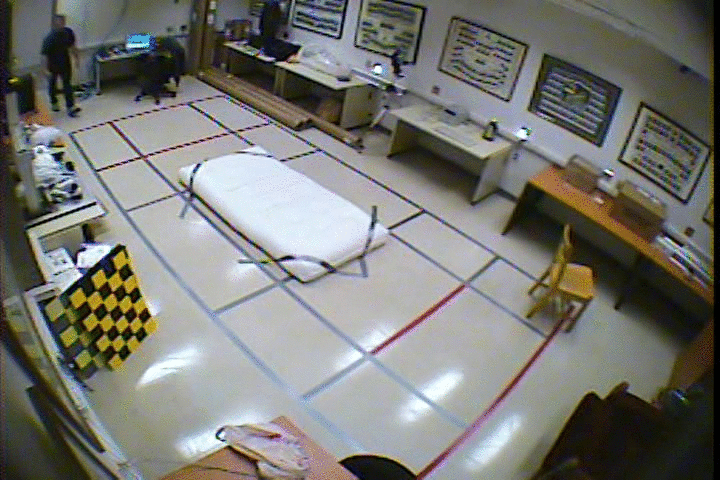

# Fall-Detection-using-MaskRCNN
## Description
The project aimed at identifying a fall instance in a home-based care setup where in a single image frame there exists more than one visible objects / person for use in homes for the elderly. This would serve as an early notification system to alert health care providers in
case a fall incident.
This project heavily relies on the publicly available Mask-RCNN implementation by Waleed Abdulla, Matterport Inc. [Mask-RCNN](https://github.com/matterport/Mask_RCNN). A big thanks to the team for creating this Mask-RCNN library.
This project was undertaken as a Master's Thesis Project. The documentation can be found [here](https://su-plus.strathmore.edu/handle/11071/6734)

## Using your own data / Installation Instructions
To train your own fall detection system, follow these instructions:
  1. Split your dataset to train and validation.
  2. Annotate your images with one class which is the fall instance. For this study the annotation tool used was [VGG Annotation Tool](https://www.robots.ox.ac.uk/~vgg/software/via/via-1.0.6.html) NB: Please name the class as "fall".
  3. Place the images in train and validation folders together with the generated JSON files.
  4. Download the weights [Mask-RCNN coco weights] (https://github.com/matterport/Mask_RCNN/releases/download/v2.0/mask_rcnn_coco.h5) if you will use a pretrained model.
  5. Train your fall detection model. Highly advisable to use a GPU in training mode.

## Samples

The images above used for testing were retrieved from [here](http://le2i.cnrs.fr/Fall-detection-Dataset?lang=en)
